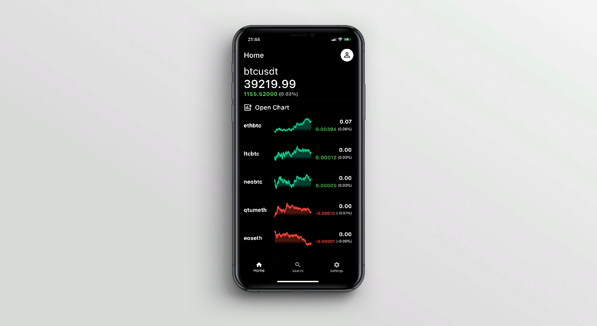
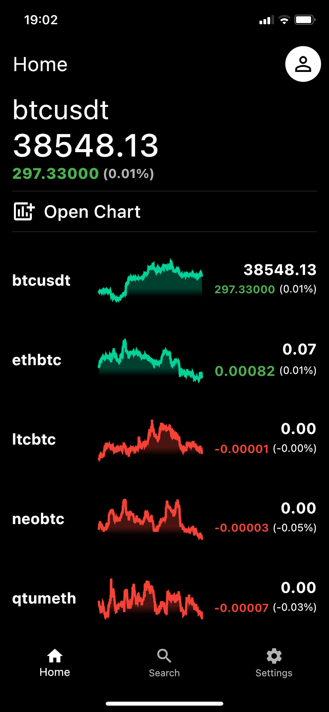
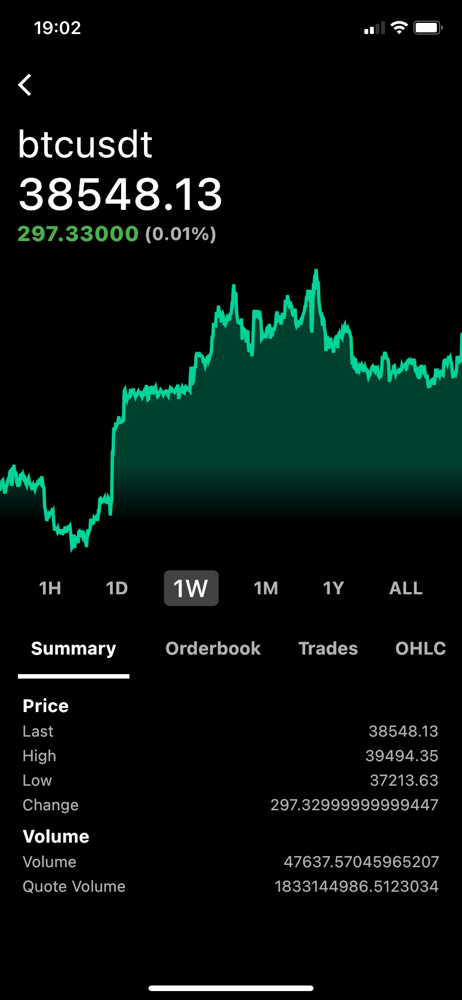
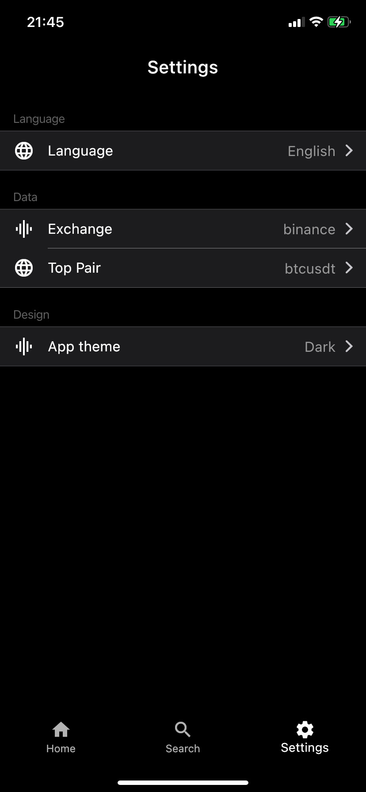
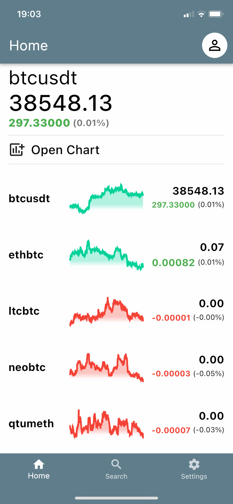
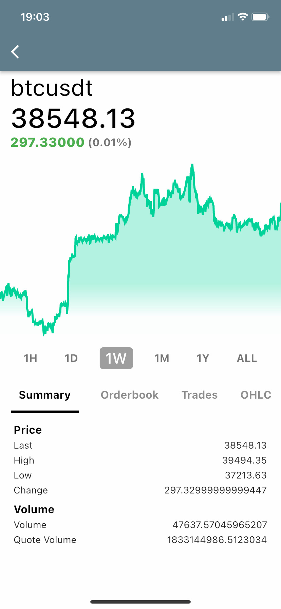
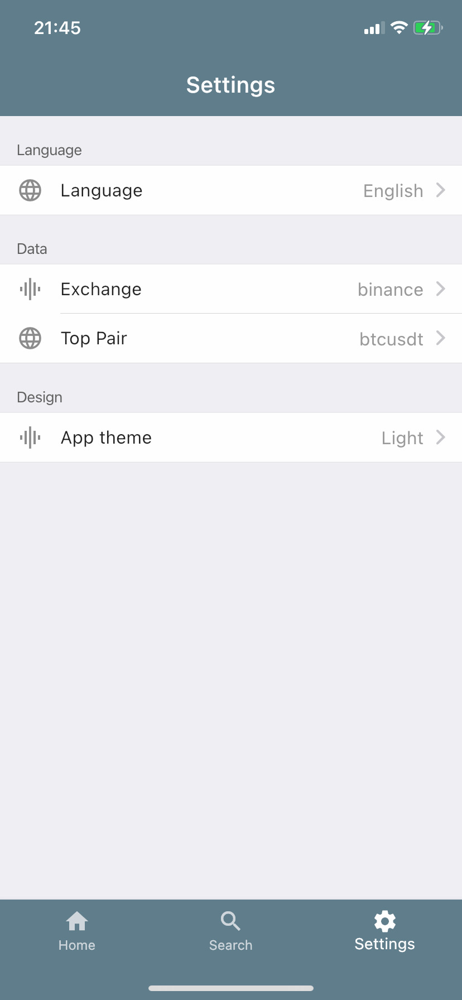

# Flutter Crypto APP
Complete Flutter Application with Riverpod & Freezed + Dio for API REST.

[](https://github.com/salvadordeveloper/flutter-crypto-app/actions/workflows/tests.yml)
[](https://github.com/salvadordeveloper/flutter-crypto-app/actions/workflows/release.yml)
[](https://codecov.io/gh/salvadordeveloper/flutter-crypto-app)
[](https://flutter.dev/docs/get-started/install)
[](https://choosealicense.com/licenses/mit/)

 

## Features 
- API REST (CryptoWatch)
- Linear Graph View (Hour, Day, Week, etc)
- OHLC Graph 
- Search 
- Light / Dark Theme
- Multi Language
- Exchange Selection
- Favorite Pair

### Stack
- Flutter 2.2.0 (Null Safety)
- Riverpod + Hooks
- Freezed
- Dio

### Testing
- Unit Testing (flutter_test)
- Integration Testing (integration_test)
- Mock Data (http_mock_adapter)
- Github Actions (iOS & Android Integration Test)

## Screenshots


| Home | Details | Settings |
|  --- |  ---    |   ---    |
||||
||||
 
## Setup project

Download project
```bash
git clone https://github.com/salvadordeveloper/flutter-crypto-app
```

Get flutter dependencies
```bash
flutter pub get
```

You need to create an account at https://cryptowat.ch/ to get a personal API KEY

Rename the env.example file to .env and put there you API KEY
```bash
API_KEY={CryptoWatch_KEY}
```

Run the app
```bash
flutter run
```

If you have any error with generated files try to run this
```bash
flutter pub run build_runner build --delete-conflicting-outputs
```


### Testing

Unit Test
```bash
flutter test
```
Integration Test
```bash
flutter drive --driver=test_driver/integration_test.dart --target=integration_test/main_test.dart
```

## Resources
[Flutter Docs](https://flutter.dev/docs)

[Riverpod Docs](https://riverpod.dev/docs/getting_started/)

[Cryptowatch Docs](https://docs.cryptowat.ch/rest-api/)


## Licence

```
MIT License

Copyright (c) 2021 Salvador Valverde

Permission is hereby granted, free of charge, to any person obtaining a copy
of this software and associated documentation files (the "Software"), to deal
in the Software without restriction, including without limitation the rights
to use, copy, modify, merge, publish, distribute, sublicense, and/or sell
copies of the Software, and to permit persons to whom the Software is
furnished to do so, subject to the following conditions:

The above copyright notice and this permission notice shall be included in all
copies or substantial portions of the Software.

THE SOFTWARE IS PROVIDED "AS IS", WITHOUT WARRANTY OF ANY KIND, EXPRESS OR
IMPLIED, INCLUDING BUT NOT LIMITED TO THE WARRANTIES OF MERCHANTABILITY,
FITNESS FOR A PARTICULAR PURPOSE AND NONINFRINGEMENT. IN NO EVENT SHALL THE
AUTHORS OR COPYRIGHT HOLDERS BE LIABLE FOR ANY CLAIM, DAMAGES OR OTHER
LIABILITY, WHETHER IN AN ACTION OF CONTRACT, TORT OR OTHERWISE, ARISING FROM,
OUT OF OR IN CONNECTION WITH THE SOFTWARE OR THE USE OR OTHER DEALINGS IN THE
SOFTWARE.
```

